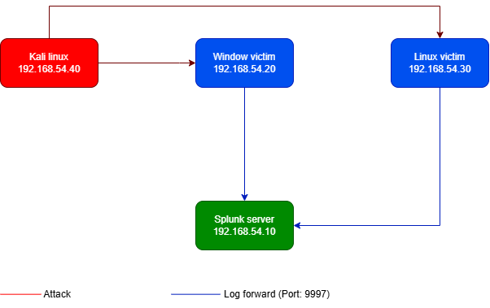

# SOC / Blue Team Home Lab

A self-built Security Operations Center (SOC) home lab designed to practice detection engineering, log analysis, and incident response — built from scratch to understand how each component works, rather than relying on pre-packaged all-in-one platforms.

> **Goal:** Build a portfolio-first, hands-on demonstration of SOC L1/L2 and Blue Team skills for entry-level roles, compensating for a limited certification budget through real detection work and documented incident response.

---

## 🏗️ Architecture



| Machine | Role | OS | Static IP |
|---|---|---|---|
| **Splunk Server** | SIEM / Log aggregation | Ubuntu Server 24.04 LTS | `192.168.54.10` |
| **Windows Victim** | Log source (Sysmon + Security Event Log) | Windows 10 Evaluation | `192.168.54.20` |
| **Linux Victim** | Log source (auth.log / syslog) | Ubuntu | `192.168.54.30` |
| **Kali Linux** | Attacker | Kali Linux (pre-built VirtualBox image) | `192.168.54.40` |

**Network design:** VirtualBox Host-only Adapter (`192.168.54.0/24`) for inter-VM communication and direct access to the Splunk Web UI from the host, plus a secondary NAT adapter per VM for internet access (updates, tool downloads). All VMs are time-synchronized (NTP via chrony / w32time) and share the same timezone to keep cross-host log correlation accurate.

**Log pipeline:** Splunk Universal Forwarder on each victim host → forwards to Splunk indexer on port `9997` → indexed into dedicated indexes (`linuxlogs`, `wineventlog`) for clean, protocol-specific SPL detection.

---

## 🛠️ Tech Stack

- **SIEM:** Splunk Enterprise 10.4.1 (self-hosted)
- **Log forwarding:** Splunk Universal Forwarder
- **Endpoint telemetry:** Sysmon (SwiftOnSecurity config), Windows Security Event Log, Linux auth.log
- **Attack tooling:** Hydra, xfreerdp
- **Virtualization:** VirtualBox (Host-only networking)
- **Frameworks:** NIST SP 800-61 (Incident Handling), MITRE ATT&CK (technique mapping)

---

## 🎯 Scenarios Completed

### 01 — SSH Brute-Force Attack (Linux Victim)
Dictionary attack against SSH (port 22) using Hydra + rockyou.txt, detected via custom SPL correlating failed-login bursts per source IP/account/minute, with an automated Splunk Alert and a monitoring dashboard.

- 📄 [Incident Report](scenarios/01-ssh-bruteforce/Incident_Report_SSH_BruteForce.pdf)
- 🔍 [SPL Detection Query](scenarios/01-ssh-bruteforce/spl-detection.md)
- 🖼️ [Screenshots](scenarios/01-ssh-bruteforce/screenshots/)

**Key skills demonstrated:** SPL field extraction (`rex`), time-binned aggregation, Splunk Alerting, breach-verification methodology (confirming zero successful logins), NIST 800-61 documentation.

### 02 — RDP Brute-Force Attack (Windows Victim)
Dictionary attack against RDP (port 3389) using Hydra, complicated by NLA/TLS handshake behavior and Windows' default Account Lockout Policy — which triggered automatic OS-level containment (Event ID 4740) before any manual analyst response.

- 📄 [Incident Report](scenarios/02-rdp-bruteforce/Incident_Report_RDP_BruteForce.pdf)
- 🔍 [SPL Detection Query](scenarios/02-rdp-bruteforce/spl-detection.md)
- 🖼️ [Screenshots](scenarios/02-rdp-bruteforce/screenshots/)

**Key skills demonstrated:** Windows Event Log analysis (4625/4624/4740), multivalue field handling (`mvindex`), Scheduled Alert design (cron scheduling pitfalls), auto-containment analysis, cross-host time synchronization troubleshooting.

### 🔜 Planned Next
- Simulated credential dumping (Mimikatz) — Sysmon Event ID 10 detection
- Simulated lateral movement (PsExec) — Sysmon Event ID 1 / 3 detection
- FortiGate integration as network gateway with syslog forwarding to Splunk

---

## 📁 Repository Structure

```
soc-blueteam-homelab/
├── README.md
├── architecture-diagram.png
├── scenarios/
│   ├── 01-ssh-bruteforce/
│   │   ├── attack-steps.md
│   │   ├── spl-detection.md
│   │   ├── incident-report.pdf
│   │   └── screenshots/
│   └── 02-rdp-bruteforce/
│       ├── attack-steps.md
│       ├── spl-detection.md
│       ├── incident-report.pdf
│       └── screenshots/
├── configs/
│   ├── windows-victim/
│   │   ├── inputs.conf
│   │   └── outputs.conf
│   └── linux-victim/
│       ├── inputs.conf
│       └── outputs.conf
└── lessons-learned.md
```

---

## 📚 Lessons Learned (Highlights)

- **Separate detection thresholds from trigger conditions:** put the "how many is abnormal" logic in the SPL (`where count > N`), and keep the Alert's trigger condition as a simple `Number of Results > 0` — mixing the two causes either alert fatigue or missed detections.
- **Scheduled Alerts need a Time Range that matches the cron interval.** Leaving it at "All time" re-scans full history every run and causes infinite re-triggering.
- **Windows Event Log fields can be multivalue** (e.g. `Account_Name` in Event 4625 bundles Subject + Target user). Always inspect raw field structure before writing detection logic — this was caught and fixed during the RDP scenario using `mvindex`.
- **Time synchronization (NTP) across every VM is a prerequisite**, not an afterthought — mismatched clocks between attacker/victim/SIEM made early log correlation look broken when it wasn't.
- **Windows' default Account Lockout Policy is a real, automatic containment control** — it stopped a live brute-force before any manual intervention, which is itself a detection-worthy event (Event ID 4740).
- Every incident report follows the same **NIST SP 800-61** structure (Preparation → Detection & Analysis → Containment → Eradication & Recovery → Lessons Learned) to build a repeatable, professional documentation habit.

---

## 👤 Author

**Nguyễn Minh Khoa** — Recent Computer Science graduate (HCMIU), pursuing entry-level SOC Analyst / Network & System Administration roles.

- Credentials: ISC2 Candidate, Fortinet NSE1, Fortinet Cybersecurity Fundamentals, Cisco Intro to Cybersecurity
- Contact: *[add email / LinkedIn here]*
